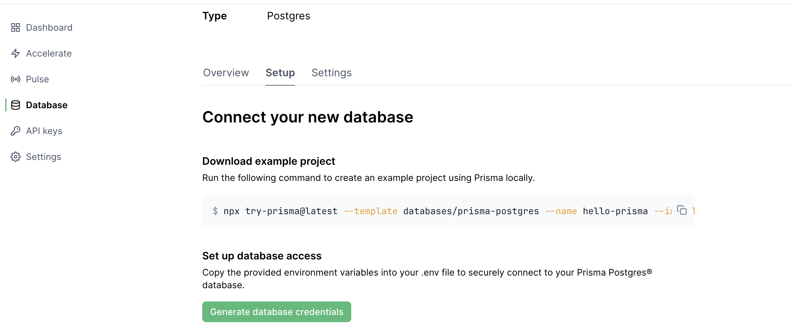
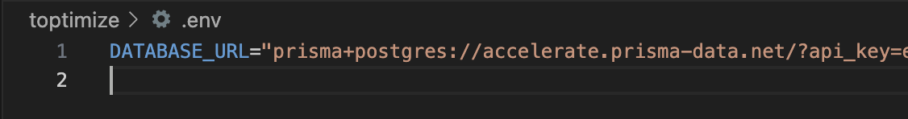
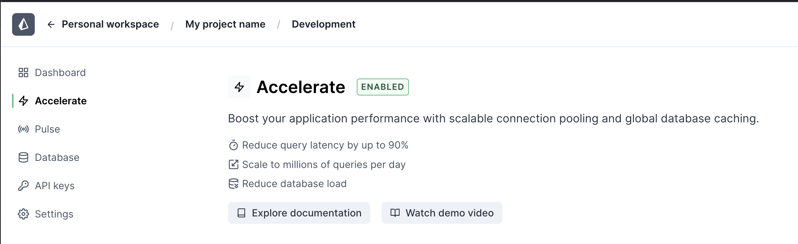
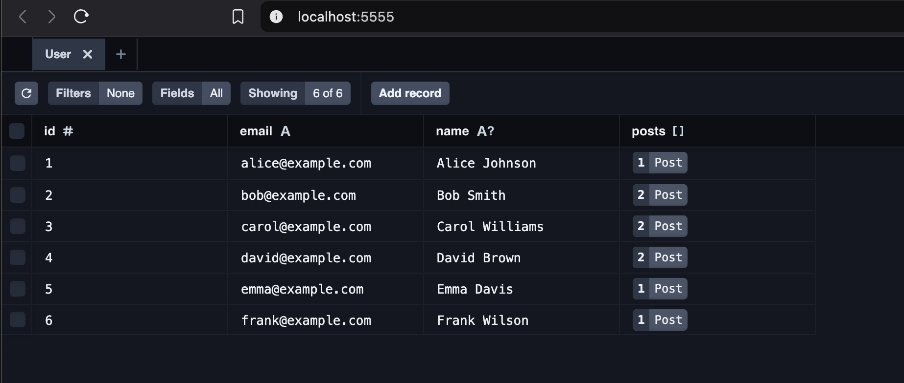
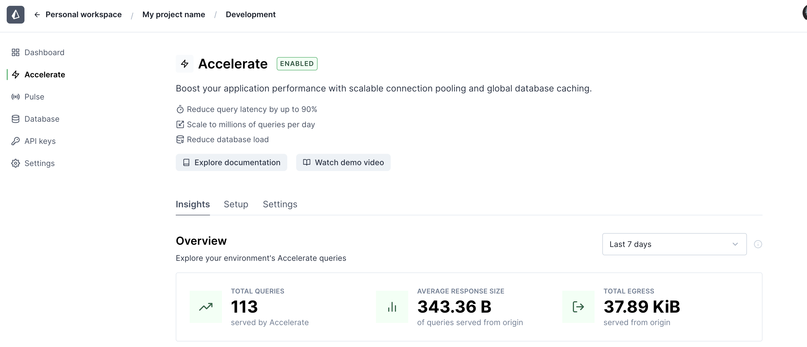

# Getting Started with Prisma Accelerate : A Next.js, Postgres, and Typescript Guide

Hey developers! Today we're diving into setting up a fantastic project that showcases Prisma Accelerate capabilities on a demo Postgres (version: 16) database. The project is designed to be beginner-friendly. Let's break this down into easy-to-follow steps.

## What We'll Build

We're setting up a project that demonstrates:
* Connection pooling with Prisma Accelerate
* Database queries using Prisma ORM
* Real-time database events via Prisma Pulse

Before we set the project in motion, here's a short list of the prerequisites a developer needs to run this project:

Development Environment:
* Node.js installed on your machine
* npm (Node Package Manager)
* Terminal/Command Line access

Accounts & Access:
* A Prisma Data Platform account (free signup at console.prisma.io)
* Access to a workspace in Prisma Data Platform
* API key for Prisma Data Platform Accelerate service

Technical Knowledge:
* Basic understanding of JavaScript/TypeScript
* Familiarity with running CLI commands
* Basic understanding of databases (helpful but not required)

Project Requirements:
* Internet connection (for database connectivity)
* Sufficient disk space for Node.js dependencies
* A code editor of your choice (e.g., VS Code, Sublime, etc.)

That's all you need to get started! If you prefer to dive in at your own pace, the setup process is well-documented in the README.md file.

## Step-by-Step Setup

### 1. Setting Up Your Database

First, let's get your database ready:
1. Head over to [Prisma Data Platform](https://console.prisma.io/)
2. Click "New project" in your workspace
3. Name your project (e.g., "toptimize")
4. Look for the "Prisma Postgres" section and click "Get started"
5. Choose your nearest region
6. Hit "Create project"

> **Pro tip**: Wait for your database status to show "CONNECTED" before moving forward.

### 2. Project Setup

Next, let's set up your project. The quickest way to experience the features of Prisma Accelerate is to build out a template Next.js project stock with configurations set from within Prisma Data Platform.

<code>
npx try-prisma@latest --template databases/prisma-postgres --name hello-prisma --install npm
</code>

Since you'll be working with sensitive data, it's a good idea to add your Prisma Data Platform API key to your environment variables. For this, an example .env file is provided. Be sure to replace the placeholder with your actual API key generated in the Postgres setup step inside Prisma Data Platform.

The .env file should look like this:

Once the credentials are set, you can tell the example will extend Accelerate to your database as it uses the URL including <code>prisma+postgres://accelerate.prisma-data.net</code>. This will allow you to observe valuable transaction insights and query performance metrics from the Prisma Data Platform Acceelerate service dashboard.

At this point, you've set up a project with Prisma Accelerate connected with a Postgres database. You can now initialize the db and build the schema from the example schema.prisma file.

### 3. Database Migration

Time to set up your database tables:

<code>
npx prisma migrate dev --name init
</code>

The first migration will create your database tables based on the models in your Prisma schema. 
> **Pro tip**: These tables will store your user and post data (for the example template in our case) but you might have to seed some data to appreciate the full potential of Prisma Accelerate. There's a `seed.ts` file in the project that you can use to seed your database with some data.

<code>
npx prisma db seed
</code>

Once the seed is complete, you can spawn up Prismaa Studio to explore your database:

<code>
npx prisma studio
</code>

This will open Prisma Studio in your default browser, allowing you to explore your database tables. If everything went well, you should see the following table.

This is an interactive database explorer that allows you to view and edit your database tables. You can use this tool to explore your database and even make changes to your data in real time. 

Watch the video below to see how to use Prisma Studio.

## What's Next?

You now have a fully functional Prisma Postgres setup! Here's what you can do:
* Explore the queries in `src/queries.ts`
* Play with the database through Prisma Studio (watch the video above)
* Start building your own features
* Explore the Prisma Data Platform Accelerate service

## Reading Metrics in Accelerate Service
Once you start adding objects to your database as well as sunning any queries to it, you should be able to see reflections of your actions as metrics under the "Insights" tab of the Accelerate service.

You'll also be able to track how much of your data is served through cache and how much is served directly from the database. Aiming for a high cache hit rate is a great way to optimize your database performance and reduce the load on your database.

## Conclusion

This setup gives you a solid foundation for building modern database applications with Prisma. The sample code contained in [the article's repository](https://github.com/rusiqe/Prisma_Tau/tree/main) will include some playful attempts at building up more queries to explore the combination of ORM capabilities, connection pooling, and real-time events. 

Here's hoping it opens up endless possibilities for your projects.

Happy coding! 🚀

